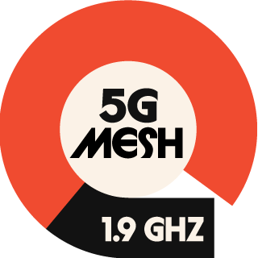

# Wirepas SDK for 5G




## Overview

This repository hosts the __Wirepas SDK for 5G profiles__. It allows the development of an application
to be executed on the same chip as Wirepas Stack.
This application is often referred as a _Single-MCU application_.

__To use this SDK, you need to have access to the Wirepas binaries. You need to have a
software license agreement (SLA) with Wirepas to get them. If you would like to become
a SLA licensee, please see the right contact from www.wirepas.com/contact__


## Version selection

To start using the sdk, please select the desired release.

They are listed on the [release page](https://github.com/wirepas/wm-sdk-5g/releases).

Each realease has a tag with following format vx.x.x (Ex: v1.0.0).

You can switch to a given release with its tag:

 ```shell
git checkout vx.x.x
```
